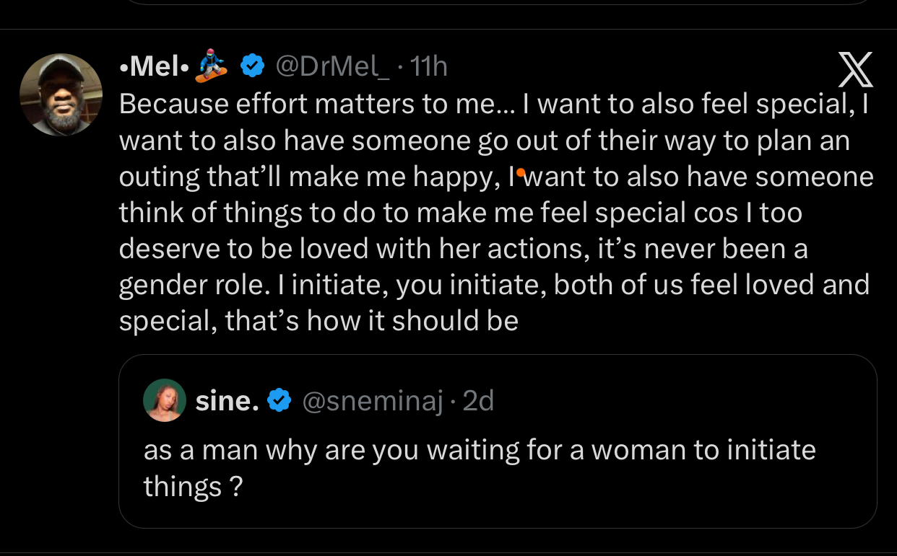

<!-- Migrated from Substack (theayodilemma.substack.com). Review before publishing. -->

There’s this Twitter exchange I saw recently that stopped my scroll dead.

A guy, @DrMel_, was responding to a question from @sneminaj who asked:

> As a man, why are you waiting for a woman to initiate things?

And instead of getting defensive, Mel just laid it out plainly. Because effort matters to me. Because I want to feel special too. I want someone to go out of their way for me, plan something, think about what would make me happy. He said:

> I too deserve to be loved with her actions. It’s never been a gender role. I initiate, you initiate, both of us feel loved and special, that’s how it should be.

I read it twice. Then I screenshotted it. Then I sent it to my notes app where tweets go to live forever.

Because ehn, somebody finally said it out loud.

---

Now, Sine’s question wasn’t necessarily coming from a bad place. I can see how it reads as practical advice, “if you want something, go get it.” Or even as a nudge. Maybe he’s waiting when he should be communicating. Those are fair readings.

But here’s where the question misses the point. Mel wasn’t saying he’s sitting at home doing nothing, waiting for a woman to chase him. He was saying he wants to be on the receiving end of thoughtfulness sometimes. He wants to feel like someone is thinking of him unprompted.

That’s not passivity. That’s just wanting to feel chosen.

And the fact that a man expressing that desire immediately gets questioned, “why are you waiting?” says a lot about the box we’ve put men in.

---

Let’s talk about that “box” for a second.

There’s this unspoken rule that men are supposed to be the pursuers. Always. The ones who plan the date, send the first text, make the first move, keep the energy alive. And if a man admits he wants to be pursued, that he wants someone to go out of their way for him, something about that feels almost... embarrassing to say out loud.

Why?

Because traditional masculinity doesn’t really have space for “I want to feel special too.” It’s wired us to see vulnerability as weakness, longing as neediness, and wanting reciprocity as somehow emasculating. So men carry this quiet exhaustion, always initiating, always giving, and they’re not even supposed to name it.

Sigh.

But here’s the thing. Wanting to feel loved is not a gender role. It is the most human thing on this list. And we’ve done both men and women a disservice by pretending otherwise.

Also, let’s separate something clearly. Initiation is not the same thing as care. Someone might not be the one starting conversations or planning outings, but they show up consistently in other ways. Support, presence, reliability. That still counts.

The real question is simpler, and sharper. Can you *feel* the effort? Is it visible, in a way that lands? Because love that is constantly invisible might as well be absent.

---

And this isn’t just a romantic relationship conversation sha. It shows up in friendships too. You’re always the one texting first. Always the one saying “we should hangout.” Always the one who remembers, who checks in, who shows up.

At some point, you start doing the math. And the math ain’t matching.

---

Now, and this matters, I’m not saying every relationship should be a perfectly balanced spreadsheet. Life doesn’t work like that. Obviously.

Sometimes one person carries more during a stressful season. Sometimes someone is grieving, or swamped with work, or going through something that makes it hard to show up the way they normally would. And in those seasons, the other person naturally gives more. That’s not imbalance. That’s just love doing what love does.

What I’m talking about is something different. It’s the chronic pattern. Where one person is permanently cast as the pursuer, across time, across contexts, across good seasons and bad ones, and the other never takes a turn. Where you’re not covering for someone in a rough patch, you’re just the default everything, always.

And sometimes, if we’re being honest, it’s not confusion or conditioning. It’s not “they don’t know how.” It’s that they’re just not as invested. That one is uncomfortable to say, but it belongs here.

Reciprocity, then, is not a perfect back-and-forth. It’s mutual investment that feels fair and intentional, even if it shows up differently on both sides.

But before we go further, let me ask something so you can reflect.

Have you actually told the person what you need?

Because sometimes we sit in the exhaustion of not being initiated on, and we’ve never once said “it would mean a lot to me if you planned something for us.” We just hope they’ll figure it out. And then we’re resentful when they don’t.

Asking for what you need is not weakness. It’s not “begging.” It’s communication, and communication is healthy. The issue isn’t that you asked. The issue is when you’ve asked, clearly, more than once, and the person still can’t find it in them to think of you.

There’s a real difference between voicing a preference and having to repeatedly remind someone that you exist.

It’s also worth asking yourself, “Am I communicating my love language and expecting others to naturally match it?” Not everyone expresses effort through planning or initiating. Some people show care through consistency, through small acts, through being available when it matters. If you don’t recognize their language, you might miss their effort. And if they don’t recognize yours, you’ll feel unseen.

And then there’s wiring. Some people over-initiate because closeness feels uncertain, so they chase it. Others hold back because too much closeness feels overwhelming, so they wait. Add a bit of positive reinforcement, they respond just enough to keep you hopeful, and before you know it, you’re stuck in a loop where you’re always the one starting things. No villain, just a pattern that quietly drains you.

---

So here’s where I drop my pen.

A lot of us have quietly accepted dynamics that are draining us. We keep giving without being given to, and somewhere along the way we convinced ourselves that’s just how it is. Or we told ourselves it would get better. Or we decided not to say anything because we didn’t want to seem needy.

But reciprocity isn’t a bonus feature. It’s the whole point.

Not a perfect 50-50 every single day. That’s not realistic and honestly sounds exhausting. But a relationship where you both invest in ways that are visible, where effort is felt, where you’re not the only one carrying the weight.

And if we’re being very honest, the person who initiates less sometimes ends up holding more power in the dynamic. That’s a conversation for another day.

If you’ve been waiting to be seen, tell them. If you’ve told them and nothing changed, that’s information too.

And if you’ve been the one not initiating, check in with yourself. It might not be malice. It might be conditioning, fear, or simply not knowing. But now you know. So do something with that.

> I initiate, you initiate. We both feel loved. We both feel chosen.

That’s the standard. Not a high one, just an honest one.

---

Have you ever been the one carrying all the effort in a relationship or friendship? Did you name it, or did you just quietly pull back? And if you’ve been on the other side, the one who wasn’t initiating, what was going on for you? Drop it in the comments. No judgment, I genuinely want to know.
