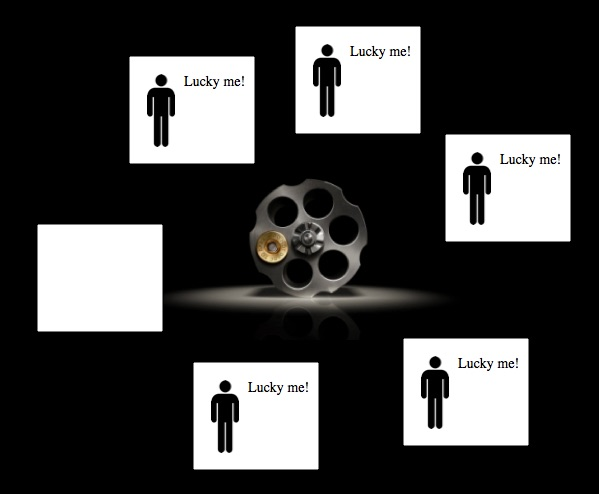

<!-- Migrated from Substack (theayodilemma.substack.com). Review before publishing. -->

Okay, that’s a really cliché subtitle but, stay with me for a second.

Imagine there’s a gun pointed at your head. The trigger is connected to a quantum particle, the smallest, strangest kind of thing physics has discovered. If the particle spins one way, the gun fires. If it goes the other way, it doesn’t. Fifty-fifty, completely random, every single time.

The trigger pulls.

*Click*. Nothing. You’re alive.

It pulls again. *Click*. Still alive.

Ten times. Fifty. A hundred. Every single time, the gun doesn’t fire. You walk out without a scratch.

Here’s the question: what the fuck just happened?

The obvious answer is that you got impossibly lucky. But there’s another answer, a stranger one, built on real physics and serious philosophy—that says you were *never* going to die. Not from your own point of view. Not ever.

The idea has a name: **[Quantum Immortality](https://en.wikipedia.org/wiki/Quantum_suicide_and_immortality)**. And before you roll your eyes and click away, I want to be upfront—this isn’t the kind of thing I can tell you is true or false. Physicists haven’t agreed on it. Philosophers haven’t settled it. What I can tell you is that the argument is more rigorous than it sounds, and the questions it forces you to ask — about what you are, what death actually means, whether your experience of being alive tells you anything reliable about the universe. Those questions don’t go away even if the theory is wrong.

So, let’s get into it.

*If every possible version of a given event does happen, then you will only (continue to) experience outcomes where you survive.*

### The Physics Part (I promise to keep it short)

Everything here rests on an idea called the **[Many-Worlds Interpretation](https://en.wikipedia.org/wiki/Many-worlds_interpretation). **To understand MWI, you need a tiny bit of quantum mechanics context. Just a tiny bit, without the equations.

Here’s the basic situation: at the quantum level, the smallest particles in existence behave in ways that don’t match how everyday objects behave. One of those weird behaviors is called **[superposition](https://en.wikipedia.org/wiki/Quantum_superposition)**— particles can exist in multiple states at once. An electron isn’t spinning left or right; it’s somehow spinning both, until something interacts with it and forces a single outcome.

The classic thought experiment for this is **[Schrödinger’s cat](https://en.wikipedia.org/wiki/Schr%C3%B6dinger%27s_cat). **A cat is sealed in a box with a quantum trigger— if the particle decays, a mechanism kills the cat. Until you open the box, the particle is technically both decayed and not decayed. Which means, in some sense, the cat is both alive and dead. Most people find this deeply unsatisfying. Physicists know the feeling.

The standard explanation is that observation forces the system to “collapse” into one outcome. You open the box, the cat is alive, the dead possibility vanishes.

But in 1957, a physicist named **Hugh Everett III **proposed something different. What if nothing collapses? What if both outcomes actually happen—just in separate, non-interacting branches of reality?

It’s also worth noting that Everett apparently believed this personally. According to his biographer, he was convinced his own theory guaranteed him immortality, that his consciousness would always branch into whichever version of him didn’t die. He lived by this idea. Whether that’s inspiring or a little alarming is probably a matter of perspective.

So when the particle decays in one branch, the cat dies. In another branch, the particle doesn’t decay, and the cat is fine. Both branches are equally real. They just can’t communicate with each other. And you, the observer, can only ever be in one of them.

Think of it like a river that forks. You're a leaf on the water. When you hit the split, you go one way — but another version of the river carries another version of you down the other path. Both keep going. You just can't see each other anymore.

This is the Many-Worlds Interpretation, or MWI. It's worth saying clearly: this is not a settled, agreed-upon fact. It's a serious hypothesis taken seriously by serious physicists — but there are other interpretations of quantum mechanics that are equally serious, and the debate is very much ongoing. This matters because the entire Quantum Immortality argument lives or dies with MWI. If the branches aren't real, none of what follows adds up.

---

### So How Does This Make Anyone Immortal?

Let’s go back to the chair. The gun. The quantum trigger.

In Many-Worlds, every time that trigger is pulled, the universe branches. In one branch, the gun fires. You die. In another, it doesn’t fire. You live.

And here’s the crucial part:

> The version of you that dies cannot experience dying.

Let’s think about this carefully. Death ends consciousness. There’s no “being dead” from the inside—no sensation, no awareness, no experience of having died. So the only branch where any version of you continues to have experiences is the branch where you survived.

If you repeat this a hundred times, and yes across the full branching tree of reality, the vast majority of yous are dead. But there is always, in every round, at least one branch where the gun didn’t fire. And that version of you will remember every click, every survived moment, with no memory of dying. Why? Because dying never happened from their perspective.

From the inside? It looks like you just keep surviving. Every time. Against all statistical odds.

This is the argument. Your subjective experience — the only kind of experience you can have — can only ever follow the branches where you remain conscious. You are, in this framework, cosmically guaranteed to always find yourself alive.

It sounds almost comforting. Like the universe has a preference for you specifically.

It doesn’t. And there’s an important caveat here before we go further — one raised by physicist Max Tegmark, who helped formalise this thought experiment. For quantum immortality to work at all, death has to be a binary, abrupt event triggered by a quantum measurement. A gun. A particle. On or off. But most real causes of death aren’t like that. They’re gradual — a slow dimming of consciousness through illness, injury, age. Tegmark himself pointed out that the thought experiment’s logic breaks down for those cases precisely because there’s no clean moment of branching. It only works in the highly controlled, almost impossible scenario we’ve been imagining.

So if you were hoping this theory gets you out of a car accident or a slow illness — it probably doesn’t. The physics doesn’t stretch that far. What it does do is raise the philosophical question. And the moment you pull on that thread, the whole thing gets very complicated very fast.

---

So that’s the mechanics of it. The physics, the argument, the limits of where it actually applies.

But here’s where I’ll stop for now — because the harder question isn’t really about quantum particles or branching universes at all. It’s something much closer to home.

Even if we accept everything above. Even if Many-Worlds is correct, and there is always a branch where you survive, and your consciousness always follows the living version of you —

> Is it actually you?

That’s not a rhetorical question. Philosophers have been arguing about it seriously for decades, and the answer is genuinely unsettling — not because there isn’t one, but because the best attempts at one make the original question look simple by comparison.

In Part 2, we’re going into the philosophy of self. What “you” actually means across branches. Why Derek Parfit might have already broken the entire concept of personal identity before quantum mechanics even enters the room. And why the hardest problem in all of science — consciousness — sits right at the centre of this.

If this first half made you uncomfortable, the second half is not going to help.

*See you there.*
