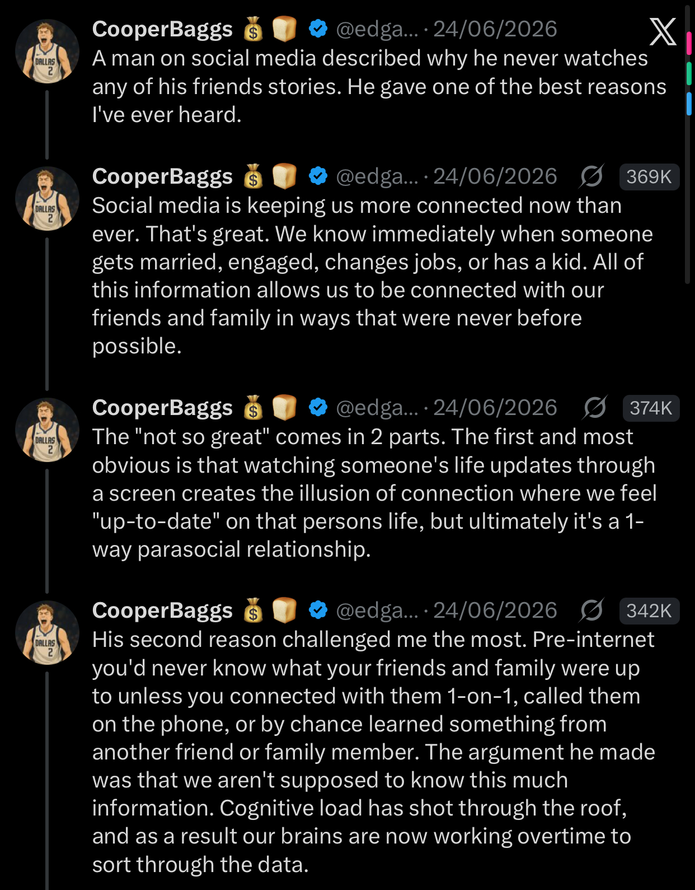
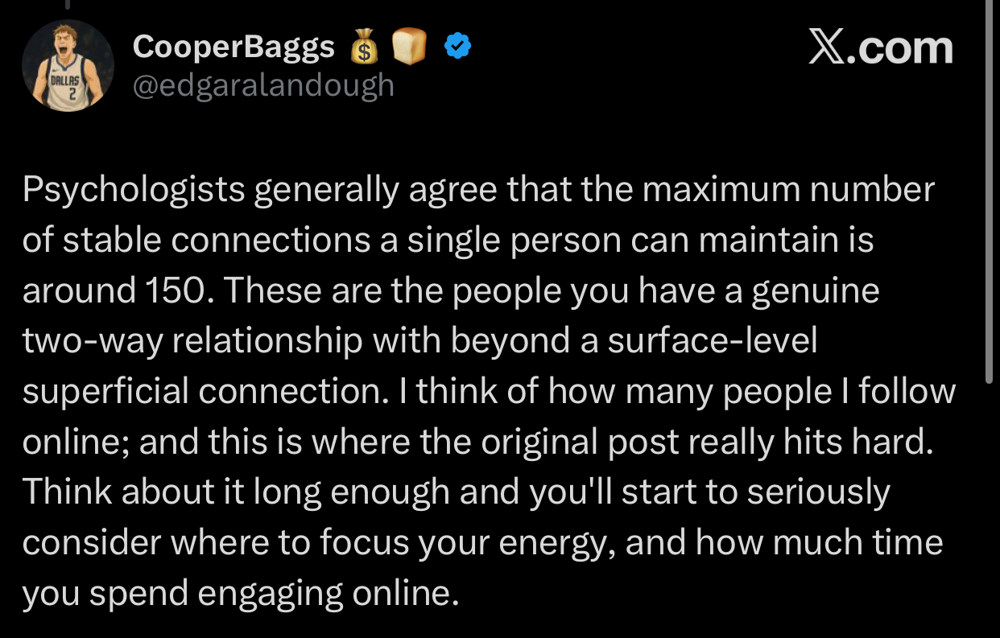

<!-- Migrated from Substack (theayodilemma.substack.com). Review before publishing. -->

I was catching up with an old acquaintance recently — someone from back when I was actively on Facebook. We hadn’t properly spoken in years. And somewhere in the conversation, she said something that made me think.

She meant it warmly. I received it warmly.

But it lodged somewhere and refused to leave.

Because what she was describing, so casually, like it was nothing — was a relationship with a version of me. The me that lives on a screen. She knows me. Sort of. She knew the me I post. And that’s not nothing, but it’s not exactly me either.

And that’s when the idea I’d been circling for months finally sat down in front of me and refused to move.

Maybe I want to leave social media.

---

Around the same time, I came across a thread on X that put words to the thing I couldn’t name. It opened with a man explaining why he never watches any of his friends’ stories— and the person sharing it called it one of the best reasons they’d ever heard. I’m inclined to agree, so let me borrow his thinking for a bit.

His starting point is one I won’t argue with: social media keeps us more connected than ever. We know the second someone gets married, gets engaged, changes jobs, has a baby. Information that used to travel by phone call, or not at all, now arrives before we’ve even asked for it. That’s genuinely a gift. I’ve watched people I would otherwise have lost completely build entire lives, one post at a time.

So no, this isn’t a “phone is bad, go and touch grass” essay. I like my phone, I like knowing things.

The problem is much quieter than that. And, as he laid it out, it comes in two parts.

---

The first part, I think most of us already half-know.

Watching someone’s life through a screen creates the feeling of connection without the actual thing. You feel up to date. You feel like you’re still in each other’s lives. But it’s one-way. You’re consuming their updates the way you’d consume a TV series or movie. [Parasocial](https://en.wikipedia.org/wiki/Parasocial_interaction), that’s the word. You know them, they might not really know you, and even when it’s mutual, nobody is actually reaching anybody.

To put this into perspective, think about what watching a story even is. You tap through fifteen seconds of someone’s afternoon. You now “know” that they went to that place, saw that sunset, are in that mood. And your brain quietly files it under *caught up*.

But you didn’t talk to them. You didn’t ask how they are. They don’t even know you were there. Nothing passed between you. You just watched. And the watching convinces you you’ve done the thing that friends do, when you actually did the opposite of it.

That’s the trick. Consumption dressed up as closeness.

---

His second reason is the one that stayed with me though. Because I hadn’t thought about it that way before.

We were never supposed to know this much.

Before the internet, you simply didn’t know what your friends and family were up to unless you connected with them directly — called, visited, or heard it secondhand from someone else. Now the updates pour in constantly, from hundreds of people at once, and our brains are working overtime to sort through it all. The cognitive load of “keeping up” with everyone has shot through the roof. And most of us don’t even register it as load. We just feel a low, background tiredness and can’t quite say why.

He also tied it to something I keep coming back to: psychologists reckon the number of stable, genuinely two-way relationships one person can hold is around 150. That’s the ceiling. Now go and count how many people you follow. The gap between those two numbers is where the exhaustion lives.

---

Here’s where I have to add my own part to his — the part my acquaintance handed me, without meaning to.

The thread is written from the position of the *watcher*. The person scrolling, consuming, and keeping up.

I’m also the *watched*.

Because if I post all the time, then I am the content in someone else’s feed. I’m the person they feel “caught up” on without ever reaching out. *Known, but not known. Seen, but not spoken to.* My acquaintance remembered me, not because we ever shared anything real, but because I performed a version of my life well enough, and often enough, that it stuck.

It’s one thing to realise you’ve been mistaking watching for closeness. It’s another thing entirely to realise you might be somebody else’s illusion.

Sit with that for a second, because that’s the part that actually unsettled me.

---

So. Am I actually leaving?

To be honest, I don’t know yet. And I’d be lying if I dressed this up as some clean, easy triumphant exit. I’m typing this on my phone with every single app still installed. 😂

But, I’ve started to think “leaving” was the wrong word all along. Because it’s not the platform I want to leave. It’s the illusion. The quiet lie that watching is the same as talking. That being updated is the same as being close. That being seen is the same as being known.

I don’t need to delete everything to fix that. I need to stop letting the feed do my relationships for me. Text the person instead of tapping through their story. Reply to the human, not the post. Let replies turn into an actual conversation instead of a heart on a photo.

That old acquaintance remembered me because I post all the time. I think I’d rather be remembered by someone because we actually talk.

Maybe that’s the version of leaving that’s worth doing. Not logging off entirely, just refusing to let the screen be the whole relationship.

---

So guys, let me ask you this, because I genuinely want to know.

Who’s someone you feel completely “caught up” on, but haven’t actually spoken to in months? And what’s stopping you from closing the app and just… calling them?

*The link to the thread that started all of this is [here](https://x.com/edgaralandough/status/2069737836442513764).*
